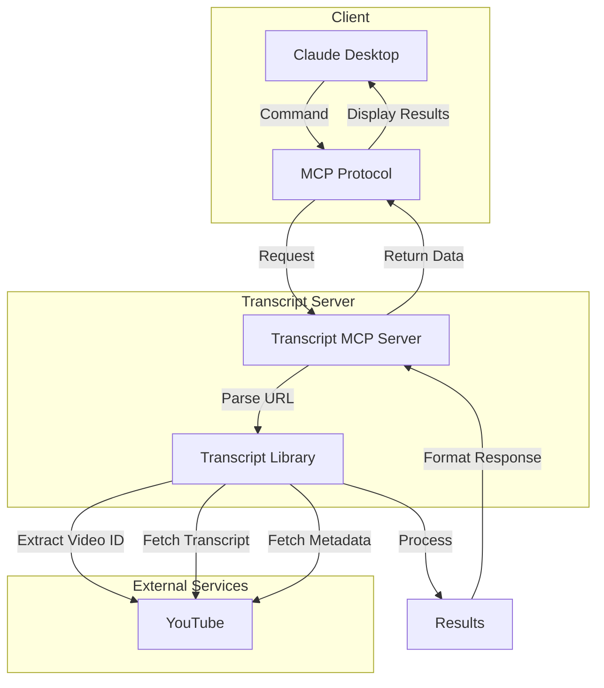
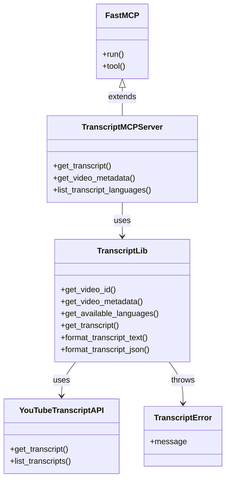
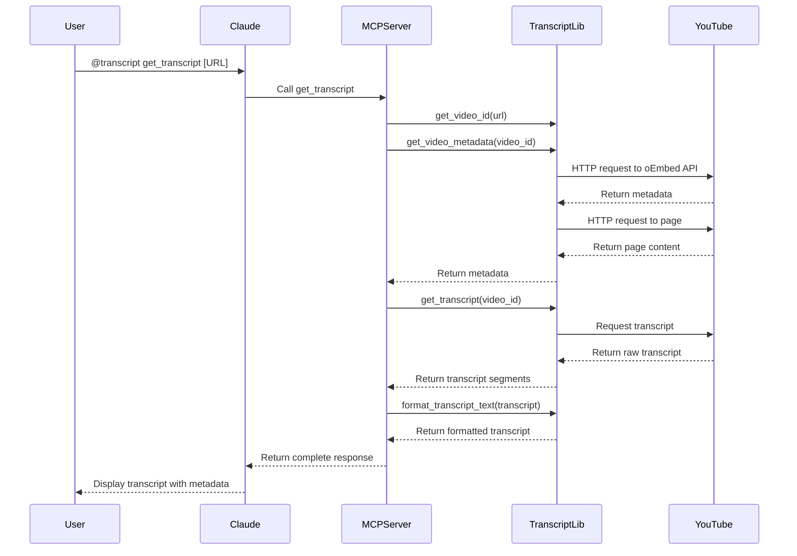

# YouTube Transcript MCP Server

An MCP server for fetching transcripts from YouTube videos directly in Claude.

## Architecture

### System Overview



### Component Structure



### Request Flow Sequence



## Setup Instructions

1. Install dependencies:
   ```
   python3 -m pip install -r requirements.txt
   ```

2. Configure Claude for Desktop:
   
   Open your Claude for Desktop App configuration at `~/Library/Application Support/Claude/claude_desktop_config.json` and add:
   
   ```json
   {
       "mcpServers": {
           "transcript": {
               "command": "python3",
               "args": [
                   "/absolute/path/to/transcript_mcp.py"
               ]
           }
       }
   }
   ```
   
   Make sure to replace `/absolute/path/to/transcript_mcp.py` with the actual path to the MCP script.

## Usage

Once configured, you can use the transcript MCP server in Claude with commands like:

```
@transcript get_transcript https://www.youtube.com/watch?v=ELj2LLNP8Ak
```

Or:

```
@transcript list_transcript_languages https://www.youtube.com/watch?v=ELj2LLNP8Ak
```

Or:

```
@transcript get_video_metadata https://www.youtube.com/watch?v=ELj2LLNP8Ak
```

## Available Tools

1. `get_transcript(url, language_code=None, include_metadata=True)`
   - Fetches a transcript for a YouTube video with timestamps in ~10 second intervals
   - Arguments:
     - `url`: YouTube video URL or ID
     - `language_code` (optional): Language code (e.g., 'en', 'es')
     - `include_metadata` (optional): Whether to include video metadata (default: True)
   - Returns:
     - Video metadata (title, author, description) if requested
     - Transcript with timestamps in a format like:
       ```
       [00:00] This is the first segment of transcript text merged into 10 second chunks
       [00:10] This is the next segment of transcript text
       ```

2. `get_video_metadata(url)`
   - Fetches metadata for a YouTube video
   - Arguments:
     - `url`: YouTube video URL or ID
   - Returns:
     - Video title
     - Author/channel name
     - Channel URL
     - Thumbnail URL
     - Video description

3. `list_transcript_languages(url)`
   - Lists available transcript languages for a YouTube video
   - Arguments:
     - `url`: YouTube video URL or ID

## Transcript Format

The transcript is formatted with timestamps in approximately 10-second intervals. Short segments are merged until they reach about 10 seconds in duration. Each line is prefixed with a timestamp in `[MM:SS]` format.

This format makes it easier to follow along with the video and reference specific parts of the content.

## Video Metadata

The server can extract the following metadata from YouTube videos:
- Video title
- Author/channel name
- Channel URL
- Thumbnail URL
- Video description

This information can be included with transcripts or retrieved separately using the `get_video_metadata` tool.

## Testing

You can test the core functionality with the included test script:

```
python3 test_transcript.py https://www.youtube.com/watch?v=ELj2LLNP8Ak
```

Or with a specific language:

```
python3 test_transcript.py https://www.youtube.com/watch?v=ELj2LLNP8Ak en
```

### Logging Test Results

The test script supports saving results to a log file:

```
python3 test_transcript.py <youtube_url_or_id> [language_code] [log_file]
```

If no log file is specified, it will automatically create one named `logs/transcript_<video_id>_<timestamp>.log` in the logs directory.

The log file contains:
- Video metadata (title, author, description)
- Complete transcript with timestamps
- Raw transcript data in JSON format (with precise timing information)
- List of available languages
- Timestamp and video metadata
