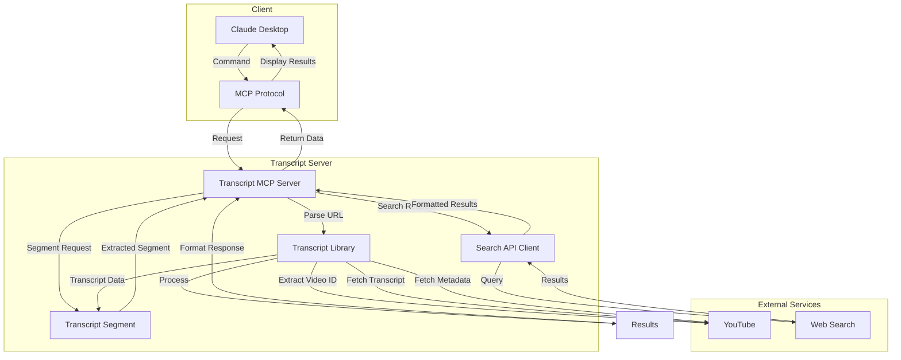
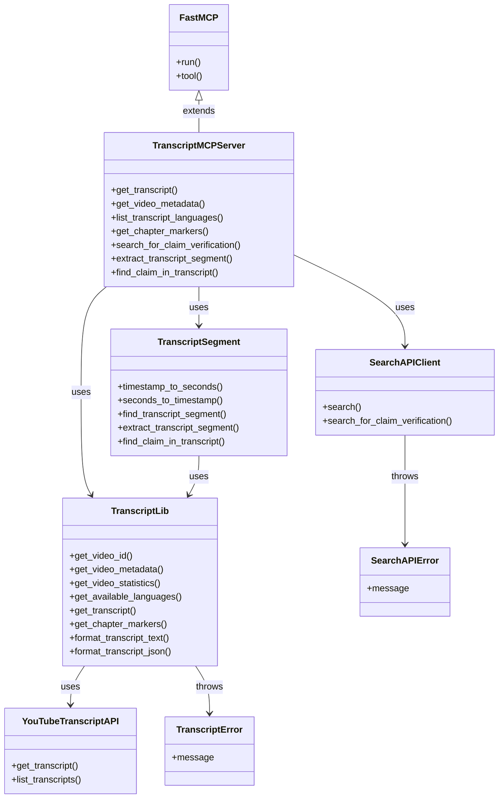

# YouTube Transcript MCP Server

An MCP server for fetching transcripts from YouTube videos directly in Claude.

> **Documentation**: For complete documentation, see the [Documentation Index](docs/index.md).

## Architecture

### System Overview



### Component Structure



### Request Flow Sequence


### Fact-Checking Request Flow

```mermaid
sequenceDiagram
    participant User
    participant Claude
    participant MCPServer
    participant TranscriptLib
    participant SearchAPI
    participant TranscriptSegment
    participant YouTube
    participant WebSearch
    
    User->>Claude: Request transcript & summarize
    Claude->>MCPServer: get_transcript(url)
    MCPServer->>TranscriptLib: Get transcript & metadata
    TranscriptLib->>YouTube: Fetch data
    YouTube-->>TranscriptLib: Return data
    TranscriptLib-->>MCPServer: Return formatted data
    MCPServer-->>Claude: Return transcript
    Claude-->>User: Display transcript & summary
    
    User->>Claude: Request fact check for claim
    Claude->>Claude: Identify claim to check
    
    alt Find Claim Location
        Claude->>MCPServer: find_claim_in_transcript(url, claim)
        MCPServer->>TranscriptLib: get_transcript(url)
        TranscriptLib->>YouTube: Fetch transcript
        YouTube-->>TranscriptLib: Return transcript
        TranscriptLib-->>MCPServer: Return transcript data
        MCPServer->>TranscriptSegment: find_claim_in_transcript(transcript, claim)
        TranscriptSegment-->>MCPServer: Return claim location & context
        MCPServer-->>Claude: Return claim context
    end
    
    alt Get Transcript Segment
        Claude->>MCPServer: extract_transcript_segment(url, timestamp)
        MCPServer->>TranscriptSegment: extract_transcript_segment(url, timestamp)
        TranscriptSegment->>TranscriptLib: get_transcript(url)
        TranscriptLib->>YouTube: Fetch transcript
        YouTube-->>TranscriptLib: Return transcript
        TranscriptLib-->>TranscriptSegment: Return transcript data
        TranscriptSegment-->>MCPServer: Return segment with context
        MCPServer-->>Claude: Return formatted segment
    end
    
    Claude->>MCPServer: search_for_claim_verification(claim, context)
    MCPServer->>SearchAPI: search_for_claim_verification(claim, context)
    SearchAPI->>WebSearch: Search for fact check
    WebSearch-->>SearchAPI: Return search results
    SearchAPI->>WebSearch: Search for direct information
    WebSearch-->>SearchAPI: Return search results
    SearchAPI-->>MCPServer: Return combined, formatted results
    MCPServer-->>Claude: Return structured search data
    
    Claude->>Claude: Analyze verification data
    Claude->>User: Present fact check results
```



## Project Status and Roadmap

This project is actively maintained. For information about:
- Current implementation status
- Completed features
- Planned enhancements
- Roadmap for future development

See the [Progress Tracker](docs/progress_tracker.md).

## Setup Instructions

1. Install dependencies:
   ```
   python3 -m pip install -r requirements.txt
   ```

2. Configure Claude for Desktop:
   
   Open your Claude for Desktop App configuration at `~/Library/Application Support/Claude/claude_desktop_config.json` and add:
   
   ```json
   {
       "mcpServers": {
           "transcript": {
               "command": "python3",
               "args": [
                   "/absolute/path/to/transcript_mcp.py"
               ]
           }
       }
   }
   ```
   
   Make sure to replace `/absolute/path/to/transcript_mcp.py` with the actual path to the MCP script.

## Usage

Once configured, you can use the transcript MCP server in Claude with commands like:

```
@transcript get_transcript https://www.youtube.com/watch?v=ELj2LLNP8Ak
```

Or:

```
@transcript list_transcript_languages https://www.youtube.com/watch?v=ELj2LLNP8Ak
```

Or:

```
@transcript get_video_metadata https://www.youtube.com/watch?v=ELj2LLNP8Ak
```

## Available Tools

1. `get_transcript(url, language_code=None, include_metadata=True, include_chapters=True)`
   - Fetches a transcript for a YouTube video with timestamps in ~10 second intervals
   - Arguments:
     - `url`: YouTube video URL or ID
     - `language_code` (optional): Language code (e.g., 'en', 'es')
     - `include_metadata` (optional): Whether to include video metadata (default: True)
     - `include_chapters` (optional): Whether to include chapter markers in the transcript (default: True)
   - Returns:
     - Video metadata (title, author, channel URL, view count, etc.) if requested
     - Chapter markers if available and requested
     - Transcript with timestamps and chapter markers

2. `get_video_metadata(url, include_statistics=True)`
   - Fetches metadata and statistics for a YouTube video
   - Arguments:
     - `url`: YouTube video URL or ID
     - `include_statistics` (optional): Whether to include view count, likes, etc. (default: True)
   - Returns:
     - Video title
     - Author/channel name
     - Channel URL
     - Thumbnail URL
     - View count (if available)
     - Like count (if available)
     - Upload date (if available)
     - Video description

3. `list_transcript_languages(url)`
   - Lists available transcript languages for a YouTube video
   - Arguments:
     - `url`: YouTube video URL or ID

4. `get_chapter_markers(url)`
   - Fetches chapter markers for a YouTube video
   - Arguments:
     - `url`: YouTube video URL or ID
   - Returns:
     - List of chapter markers with timestamps and titles, or a message if no chapters are found

5. `search_for_claim_verification(claim, context=None)`
   - Searches for information to help verify a claim made in a video
   - Arguments:
     - `claim`: The specific claim to verify (a statement that can be true or false)
     - `context` (optional): Context from the video to help with the search
   - Returns:
     - JSON-formatted search results with fact-checking and general information

6. `extract_transcript_segment(url, timestamp, context_seconds=30)`
   - Extracts a specific segment of a transcript around a timestamp
   - Arguments:
     - `url`: YouTube video URL or ID
     - `timestamp`: Timestamp in format MM:SS or HH:MM:SS
     - `context_seconds` (optional): Number of seconds of context before and after (default: 30)
   - Returns:
     - The transcript segment with metadata

7. `find_claim_in_transcript(url, claim, fuzzy_match=True)`
   - Finds a specific claim in a transcript and returns its timestamp and context
   - Arguments:
     - `url`: YouTube video URL or ID
     - `claim`: The claim to find
     - `fuzzy_match` (optional): Whether to use fuzzy matching (default: True)
   - Returns:
     - Timestamp and context of the claim if found

## Transcript Format

The transcript is formatted with timestamps in approximately 10-second intervals. Short segments are merged until they reach about 10 seconds in duration. Each line is prefixed with a timestamp in `[MM:SS]` format.

When chapter markers are available and included, they are displayed in two ways:
1. As a complete list at the top of the response under the "Chapter Markers" section
2. Inserted at appropriate positions in the transcript with a format like `[CHAPTER] MM:SS - Chapter Title`

This dual approach makes it easier to get an overview of the video structure while also seeing chapter transitions as you read through the content.

## Video Metadata and Statistics

The server can extract the following information from YouTube videos:
- Video title
- Author/channel name
- Channel URL
- Thumbnail URL
- View count
- Like count
- Upload date
- Video description

This information can be included with transcripts or retrieved separately using the `get_video_metadata` tool.

## Chapter Markers

Chapter markers are segments of a video defined by the video creator. The server can extract these markers from YouTube videos when available. Each chapter has:
- A title describing the content
- A timestamp indicating when the chapter starts
- A formatted time string (HH:MM:SS or MM:SS)

Chapter markers can be included directly in the transcript to provide additional context and structure, or retrieved separately using the `get_chapter_markers` tool.

## Fact-Checking

The server provides several tools to help Claude verify information from YouTube videos:

1. **Claim Verification Search**: Uses web search to find information that can verify claims made in videos
2. **Transcript Segment Extraction**: Extracts specific segments of transcripts around timestamps for focused analysis
3. **Claim Finding**: Locates claims within transcripts with exact or fuzzy matching

When fact-checking, Claude can:
1. First identify specific claims from the video transcript
2. Find where in the transcript the claim appears
3. Gather context around the claim
4. Search for verification information
5. Analyze the results to provide a fact-check assessment

### Example Fact-Checking Flow

```
User: @transcript get_transcript https://www.youtube.com/watch?v=ELj2LLNP8Ak and summarize

Claude: [fetches transcript and provides summary]

User: Please fact check the claim that "AI will replace all programmers by 2025" made at 12:34 in the video

Claude: Let me check this claim carefully.

First, I'll extract the segment from the video to verify the exact wording...

[uses extract_transcript_segment to get context]

Now I'll search for information to verify this claim...

[uses search_for_claim_verification to gather data]

Based on my research:
1. Expert consensus from multiple sources indicates that AI will augment programming rather than completely replace programmers by 2025
2. While AI coding assistants are becoming more capable, they still require human oversight and direction
3. The claim appears to be an exaggeration that contradicts current industry projections

The claim that "AI will replace all programmers by 2025" is not supported by current evidence and expert analysis.
```

### Search API Configuration

The search functionality requires a search API key. To configure this:

1. Get an API key from a search provider (default implementation uses Serper.dev)
2. Set the environment variable `SEARCH_API_KEY` with your API key:
   ```
   export SEARCH_API_KEY=your_api_key_here
   ```

## Testing

You can test the core functionality with the included test scripts:

```
python3 test_transcript.py [video_id] [language_code]
python3 test_chapter_markers.py [video_id]
python3 test_statistics.py [video_id]
python3 test_top_chapter_markers.py [video_id] [language_code]
```

Notes:
- Always run test scripts with `python3` rather than making them executable
- The `video_id` parameter can be a full YouTube URL or just the ID
- If no `video_id` is provided, a default testing video will be used
- Log files with timestamps are saved in the `logs/` directory

## Development Guidelines

When developing for this project:

1. Always run Python scripts using `python3` rather than making them executable
2. Test changes thoroughly with the provided test scripts
3. Document any significant changes in the appropriate documentation files
4. Follow the existing code style for consistency
