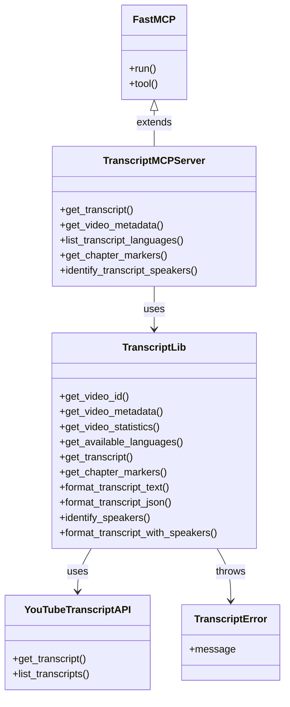
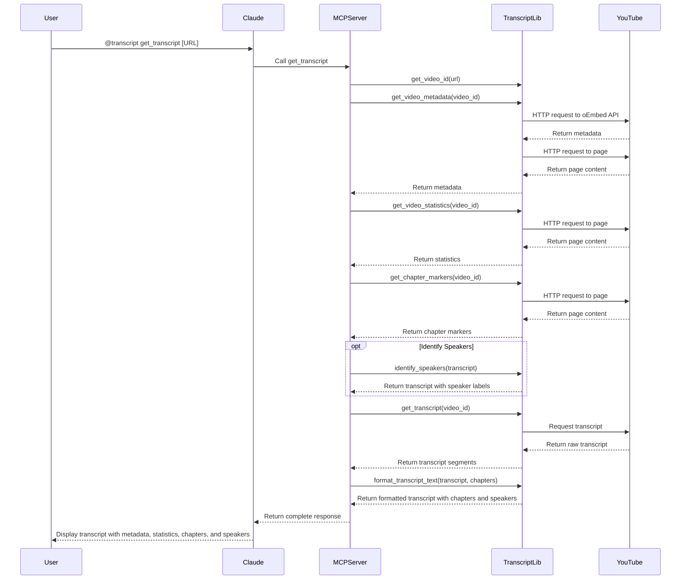

# YouTube Transcript MCP Server

An MCP server for fetching transcripts from YouTube videos directly in Claude.

> **Documentation**: For complete documentation, see the [Documentation Index](docs/index.md).

## Architecture

### System Overview


### Component Structure



### Request Flow Sequence



## Project Status and Roadmap

This project is actively maintained. For information about:
- Current implementation status
- Completed features
- Planned enhancements
- Roadmap for future development

See the [Progress Tracker](docs/progress_tracker.md).

## Setup Instructions

1. Install dependencies:
   ```
   python3 -m pip install -r requirements.txt
   ```

2. Configure Claude for Desktop:
   
   Open your Claude for Desktop App configuration at `~/Library/Application Support/Claude/claude_desktop_config.json` and add:
   
   ```json
   {
       "mcpServers": {
           "transcript": {
               "command": "python3",
               "args": [
                   "/absolute/path/to/transcript_mcp.py"
               ]
           }
       }
   }
   ```
   
   Make sure to replace `/absolute/path/to/transcript_mcp.py` with the actual path to the MCP script.

## Usage

Once configured, you can use the transcript MCP server in Claude with commands like:

```
@transcript get_transcript https://www.youtube.com/watch?v=ELj2LLNP8Ak
```

Or:

```
@transcript list_transcript_languages https://www.youtube.com/watch?v=ELj2LLNP8Ak
```

Or:

```
@transcript get_video_metadata https://www.youtube.com/watch?v=ELj2LLNP8Ak
```

## Available Tools

1. `get_transcript(url, language_code=None, include_metadata=True, include_chapters=True, identify_speakers=False, speaker_hints=None)`
   - Fetches a transcript for a YouTube video with timestamps in ~10 second intervals
   - Arguments:
     - `url`: YouTube video URL or ID
     - `language_code` (optional): Language code (e.g., 'en', 'es')
     - `include_metadata` (optional): Whether to include video metadata (default: True)
     - `include_chapters` (optional): Whether to include chapter markers in the transcript (default: True)
     - `identify_speakers` (optional): Whether to identify speakers in the transcript (default: False)
     - `speaker_hints` (optional): List of speaker names to look for (default: None)
   - Returns:
     - Video metadata (title, author, channel URL, view count, etc.) if requested
     - Chapter markers if available and requested
     - Identified speakers with statistics if speaker identification is enabled
     - Transcript with timestamps, chapter markers, and speaker labels as applicable

2. `get_video_metadata(url, include_statistics=True)`
   - Fetches metadata and statistics for a YouTube video
   - Arguments:
     - `url`: YouTube video URL or ID
     - `include_statistics` (optional): Whether to include view count, likes, etc. (default: True)
   - Returns:
     - Video title
     - Author/channel name
     - Channel URL
     - Thumbnail URL
     - View count (if available)
     - Like count (if available)
     - Upload date (if available)
     - Video description

3. `list_transcript_languages(url)`
   - Lists available transcript languages for a YouTube video
   - Arguments:
     - `url`: YouTube video URL or ID

4. `get_chapter_markers(url)`
   - Fetches chapter markers for a YouTube video
   - Arguments:
     - `url`: YouTube video URL or ID
   - Returns:
     - List of chapter markers with timestamps and titles, or a message if no chapters are found

5. `identify_transcript_speakers(url, language_code=None, speaker_hints=None)`
   - Identifies potential speakers in a YouTube video transcript
   - Arguments:
     - `url`: YouTube video URL or ID
     - `language_code` (optional): Language code (e.g., 'en', 'es')
     - `speaker_hints` (optional): List of speaker names to look for
   - Returns:
     - List of identified speakers with statistics
     - Transcript with speaker labels in a format like:
       ```
       [00:00] <John> Welcome to our discussion on artificial intelligence.
       [00:10] <Sarah> Thanks for having me, John.
       ```

## Transcript Format

The transcript is formatted with timestamps in approximately 10-second intervals. Short segments are merged until they reach about 10 seconds in duration. Each line is prefixed with a timestamp in `[MM:SS]` format.

When chapter markers are available and included, they are inserted at appropriate positions in the transcript with a format like `[CHAPTER] MM:SS - Chapter Title`. This makes it easier to navigate through the content.

When speaker identification is enabled, the transcript format includes speaker labels:

```
[00:00] <John> Welcome to our discussion on artificial intelligence.
[00:05] <Sarah> Thanks for having me, John. I'm excited to discuss this topic.
[00:12] This technology is transforming industries worldwide.
[00:18] <John> What are some of the biggest developments recently?
```

Speaker labels are enclosed in angle brackets and positioned between the timestamp and the text. Segments without an identified speaker just show the timestamp and text.

## Video Metadata and Statistics

The server can extract the following information from YouTube videos:
- Video title
- Author/channel name
- Channel URL
- Thumbnail URL
- View count
- Like count
- Upload date
- Video description

This information can be included with transcripts or retrieved separately using the `get_video_metadata` tool.

## Chapter Markers

Chapter markers are segments of a video defined by the video creator. The server can extract these markers from YouTube videos when available. Each chapter has:
- A title describing the content
- A timestamp indicating when the chapter starts
- A formatted time string (HH:MM:SS or MM:SS)

Chapter markers can be included directly in the transcript to provide additional context and structure, or retrieved separately using the `get_chapter_markers` tool.

## Speaker Identification

The server can attempt to identify speakers in transcript text, which is particularly useful for interviews, panel discussions, and other multi-speaker content.

Speaker identification works by:
- Looking for common speaker label formats in the text (e.g., "John:", "[Sarah]", "(Host)")
- Extracting and organizing these labels
- Associating them with the correct transcript segments
- Providing statistics about each speaker's participation

This is a best-effort approach that relies on the transcript text already containing speaker labels. It doesn't use audio analysis to identify unlabeled speakers.

## Testing

You can test the core functionality with the included test script:

```
python3 test_transcript.py https://www.youtube.com/watch?v=ELj2LLNP8Ak
```

Or with a specific language:

```
python3 test_transcript.py https://www.youtube.com/watch?v=ELj2LLNP8Ak en
```

### Logging Test Results

The test script supports saving results to a log file:

```
python3 test_transcript.py <youtube_url_or_id> [language_code] [log_file]
```

If no log file is specified, it will automatically create one named `logs/transcript_<video_id>_<timestamp>.log` in the logs directory.

The log file contains:
- Video metadata (title, author, description)
- Complete transcript with timestamps
- Raw transcript data in JSON format (with precise timing information)
- List of available languages
- Timestamp and video metadata

### Testing Chapter Markers and Statistics

You can test the chapter markers extraction with:

```
python3 test_chapter_markers.py https://www.youtube.com/watch?v=pvkTC2xIbeY
```

And video statistics retrieval with:

```
python3 test_statistics.py https://www.youtube.com/watch?v=ELj2LLNP8Ak
```

For more detailed analysis, you can add the debug flag to the chapter markers test:

```
python3 test_chapter_markers.py https://www.youtube.com/watch?v=pvkTC2xIbeY --debug
```

### Testing Speaker Identification

You can test the speaker identification with the provided sample data:

```
python3 test_with_sample_data.py
```

This will demonstrate how the speaker identification works with a sample transcript containing various speaker label formats.

You can also test it with a real YouTube video (if it has speaker labels in the transcript):

```
python3 test_speaker_identification.py <youtube_url>
```
