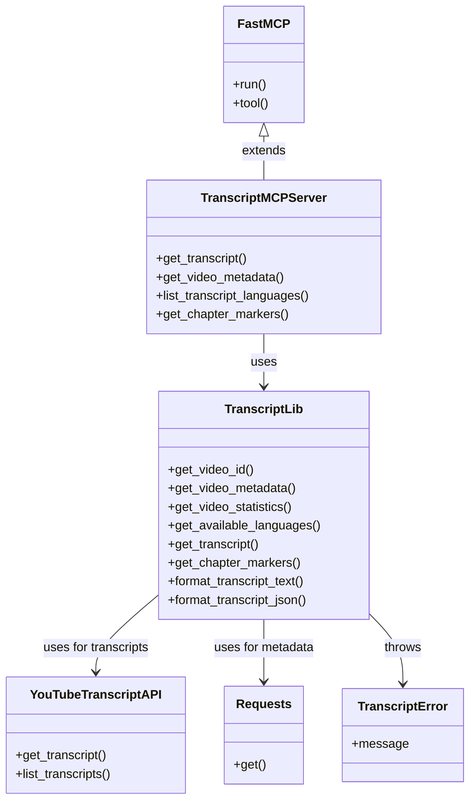
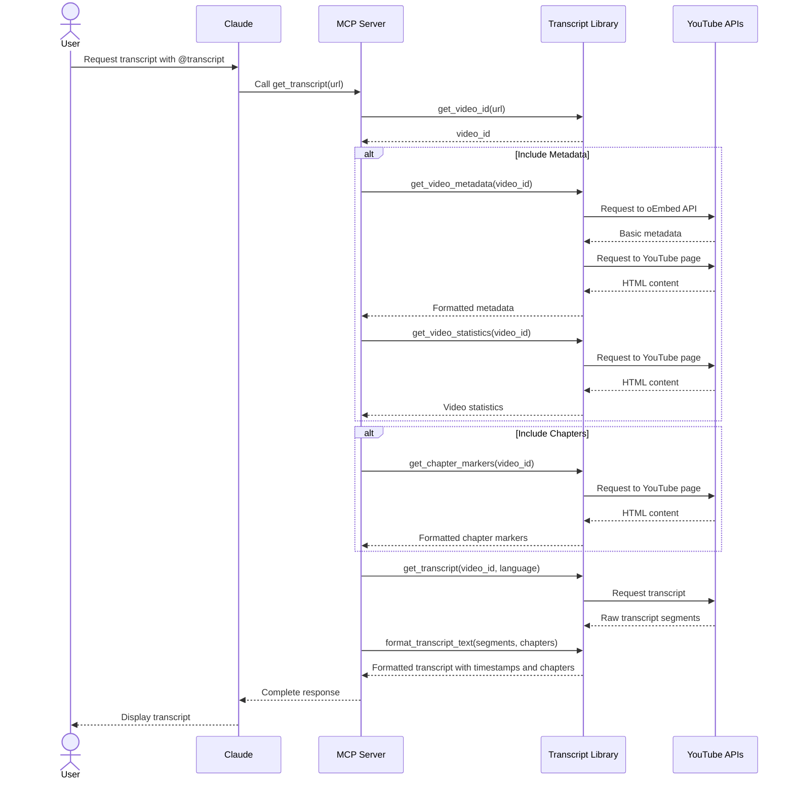

# Developer Guide: YouTube Transcript MCP Server

This guide provides a comprehensive overview of the YouTube Transcript MCP server architecture, implementation details, and development considerations for new contributors.

## Architectural Overview

The YouTube Transcript MCP server is built as a bridge between Claude and YouTube's transcript data. It leverages the MCP (Machine-Callable Program) protocol to enable Claude to fetch and process video transcripts in a structured way.

### System Architecture

```mermaid
graph TD
    subgraph "User Environment"
        User([User]) -->|Ask for transcript| Claude([Claude AI])
        Claude -->|Display results| User
    end
    
    subgraph "MCP Protocol"
        Claude -->|@transcript command| MCP[MCP Interface]
        MCP -->|Formatted response| Claude
    end
    
    subgraph "Transcript Server"
        MCP -->|Request| Server[Transcript MCP Server]
        Server -->|Process request| Library[Transcript Library]
        Library -->|Return data| Server
        Server -->|Formatted response| MCP
    end
    
    subgraph "External Services"
        Library -->|Fetch transcript| YT_API[YouTube Transcript API]
        Library -->|Fetch metadata| YT_Metadata[YouTube oEmbed API]
        Library -->|Fetch description| YT_Page[YouTube Page]
    end
    
    style User fill:#f9f,stroke:#333,stroke-width:2px
    style Claude fill:#bbf,stroke:#333,stroke-width:2px
    style Server fill:#bfb,stroke:#333,stroke-width:2px
    style Library fill:#bfb,stroke:#333,stroke-width:2px
    style YT_API fill:#fbb,stroke:#333,stroke-width:2px
    style YT_Metadata fill:#fbb,stroke:#333,stroke-width:2px
    style YT_Page fill:#fbb,stroke:#333,stroke-width:2px
```

### Component Diagram



### Data Flow Sequence



### Key Components

1. **MCP Server Layer (`transcript_mcp.py`)**
   - Implements the MCP protocol interface using FastMCP
   - Exposes tools for transcript, metadata, statistics, and chapter markers retrieval
   - Handles parameter parsing and response formatting

2. **Transcript Library (`transcript_lib.py`)**
   - Core business logic for transcript processing
   - Handles video ID extraction
   - Fetches transcript data, metadata, statistics, and chapter markers
   - Formats transcript text with timestamps and chapter markers

3. **External Dependencies**
   - `youtube-transcript-api`: Primary engine for fetching transcript data
   - `requests`: Used for metadata retrieval through YouTube's oEmbed API
   - `mcp`: Framework for building MCP-compatible servers

4. **Testing Infrastructure**
   - `test_transcript.py`: Tests the transcript functionality with logging
   - `test_chapter_markers.py`: Tests the chapter markers extraction functionality
   - `test_statistics.py`: Tests video statistics retrieval

## Implementation Insights

### YouTube Transcript API Integration

The `youtube-transcript-api` package does the heavy lifting of transcript fetching, but has some limitations:

1. **Transcript Segmentation**
   - YouTube returns transcripts in very small segments (often 1-5 seconds)
   - Our implementation merges these into more readable ~10-second chunks
   - This merging logic is implemented in `format_transcript_text()` for better readability

2. **Language Handling**
   - Transcripts can exist in multiple languages
   - We offer a dedicated tool to list available languages
   - Automatic fallback to default language when not specified

### Metadata Extraction Approach

YouTube doesn't provide a simple public API for metadata, so we implemented a two-stage approach:

1. **oEmbed API** (primary source)
   - Used to fetch basic metadata (title, author)
   - Relatively stable and reliable
   - Limited in the information it provides

2. **HTML Parsing** (fallback for description)
   - We use regex to extract the description from page metadata
   - More fragile but necessary for getting the description
   - Implemented with error handling to avoid complete failures

This hybrid approach provides the best balance of reliability and comprehensive metadata.

### Timestamp Merging Logic

One of the more complex parts of the implementation is the algorithm for merging transcript segments:

```python
def format_transcript_text(transcript):
    merged_segments = []
    current_text = ""
    current_start = transcript[0]["start"]
    current_duration = 0
    
    for segment in transcript:
        # If adding this segment would exceed ~10 seconds, start a new merged segment
        if current_duration > 0 and current_duration + segment["duration"] > 10:
            # Format time as MM:SS
            minutes = int(current_start / 60)
            seconds = int(current_start % 60)
            timestamp = f"[{minutes:02d}:{seconds:02d}]"
            
            # Add the current merged segment to the result
            merged_segments.append(f"{timestamp} {current_text}")
            
            # Start a new segment
            current_text = segment["text"]
            current_start = segment["start"]
            current_duration = segment["duration"]
        else:
            # Add to the current segment
            if current_text:
                current_text += " " + segment["text"]
            else:
                current_text = segment["text"]
            current_duration += segment["duration"]
```

This algorithm:
1. Tracks the current accumulated duration
2. Merges segments until the ~10 second threshold is reached
3. Preserves the original start time for accurate timestamping

### Chapter Markers Extraction

One of the more complex features is the extraction of chapter markers from YouTube videos:

1. **Multiple Extraction Methods**
   - YouTube doesn't provide a dedicated API for chapters
   - We use several methods to maximize chances of success
   - Each method targets a different way YouTube might store chapter data

2. **Extraction Strategy**
   - First try to extract from the description (common user-created format)
   - Then look for structured data in various JSON objects in the page
   - Fall back to parsing the player response JSON
   - Finally check for structured LD+JSON metadata

3. **Integration with Transcript**
   - Chapters are displayed in two ways:
     - As a complete list at the top of the transcript output
     - Inserted at appropriate timestamps within the transcript text
   - This helps users both get an overview of the video structure and navigate long transcripts more easily

### Video Statistics Extraction

The video statistics feature was added to provide more comprehensive information about the videos:

1. **Extraction Methods**
   - Like chapter markers, we use HTML parsing to extract statistics
   - We target the initial data structure in the YouTube page
   - Look for key metrics like view count, likes, and upload date

2. **Error Handling**
   - Some statistics may be hidden or unavailable for certain videos
   - Our implementation handles missing statistics gracefully
   - Each metric is extracted independently, so a failure in one doesn't affect others

3. **Integration with Metadata**
   - Statistics can be included with standard metadata
   - This provides a more complete picture of the video context

## Development Guidelines

### Adding New Features

When adding new features to the YouTube Transcript MCP server, consider the following guidelines:

1. **Maintain Architecture**
   - Keep the separation between MCP server and core library
   - Add new functionality to the appropriate layer
   - Update documentation to reflect architectural changes

2. **Error Handling**
   - YouTube's structure can change or be inconsistent
   - Always include fallback mechanisms and error handling
   - Provide meaningful error messages for user feedback

3. **Testing**
   - Add appropriate test scripts for new functionality
   - Test with various YouTube videos to ensure robustness
   - Include logging for debugging and verification

### Feature Evaluation and Refactoring

As the project evolves, it's important to regularly evaluate features based on their effectiveness and value:

1. **Effectiveness Assessment**
   - Regularly test features with real-world YouTube videos
   - Gather feedback on the utility and reliability of each feature
   - Identify features that aren't working as intended or providing sufficient value

2. **Refactoring Considerations**
   - Simplify code where possible to improve maintainability
   - Remove features that don't provide adequate value relative to their complexity
   - Document architectural decisions and changes in the project_updates.md file

3. **Maintaining Core Value**
   - Focus development efforts on core functionality that provides the most user value
   - Prioritize reliability and robustness over adding new features
   - Consider the integration with Claude when evaluating feature importance

### Future Directions

The most promising areas for future development include:

1. **Reliability Improvements**
   - Add caching for frequently accessed videos
   - Improve error handling and recovery mechanisms
   - Add automated testing for core functionality

2. **Enhanced Transcript Processing**
   - Implement paragraph-based segmentation options
   - Add support for SRT and other transcript formats
   - Explore transcript summarization capabilities

3. **Search and Analysis**
   - Add search functionality within transcripts
   - Implement topic and keyword extraction
   - Enable cross-video analysis for related content

## Troubleshooting Common Issues

### YouTube API Changes

YouTube frequently changes its page structure, which can affect metadata extraction. If you encounter issues:

1. Check for changes in YouTube's page structure
2. Update regex patterns in the metadata extraction functions
3. Consider implementing additional fallback mechanisms

### Transcript Unavailability

Some videos may not have transcripts available. The server already handles this gracefully, but be aware that:

1. User-generated captions may be inconsistently formatted
2. Some channels disable transcripts for their videos
3. Automatic transcripts may have poor quality

### MCP Integration

If Claude is having trouble communicating with the MCP server:

1. Verify the configuration in claude_desktop_config.json
2. Check that paths to the MCP script are correct
3. Ensure the MCP server is properly responding to requests

## Documentation Maintenance

When updating the codebase, be sure to keep documentation in sync:

1. Update README.md with any user-facing changes
2. Update developer_guide.md with implementation details
3. Update progress_tracker.md to reflect completed features
4. Add significant architectural changes to project_updates.md

## Contributing

Contributions are welcome! Please follow these steps:

1. Check the progress_tracker.md for potential contribution areas
2. Fork the repository and create a feature branch
3. Implement your changes with appropriate tests and documentation
4. Submit a pull request with a clear description of your changes

Refer to the [Project Updates](project_updates.md) document for a history of major architectural decisions and changes.

### Running and Testing Scripts

1. **Running Scripts**
   - Always use `python3` to run scripts directly, rather than making them executable:
     ```
     python3 script_name.py [arguments]
     ```
   - This ensures consistent execution across different development environments

2. **Test First Development**
   - Create or update test scripts before modifying core functionality
   - Use the provided test scripts to verify changes:
     ```
     python3 test_transcript.py [video_id]
     python3 test_chapter_markers.py [video_id]
     python3 test_statistics.py [video_id]
     python3 test_top_chapter_markers.py [video_id]
     ```

3. **Logging Results**
   - All test scripts automatically save results to the `logs/` directory
   - Review these logs to verify changes and understand behavior

### Code Organization

// ... existing code ... 