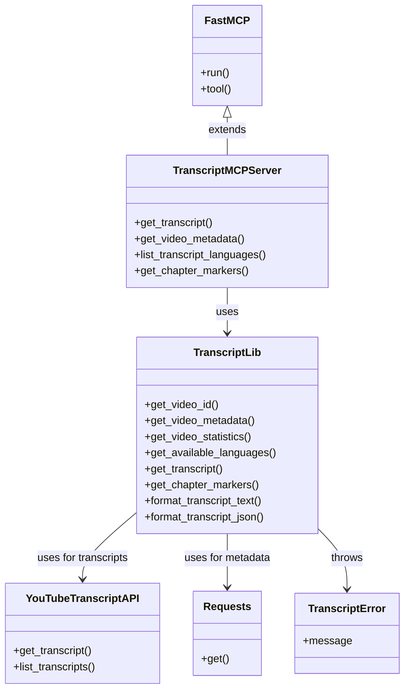
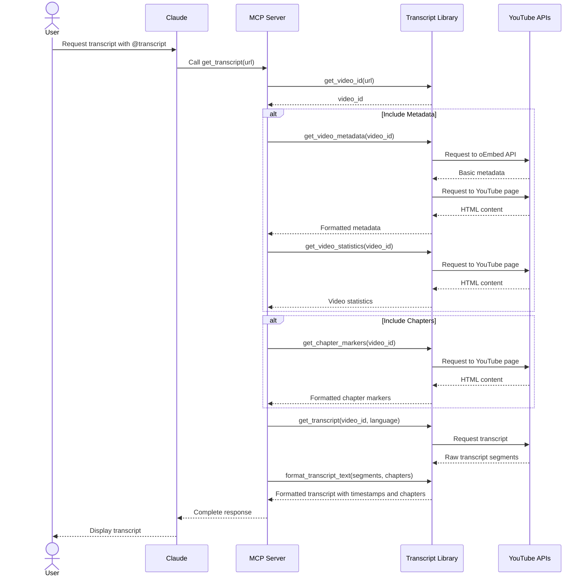

# Developer Guide: YouTube Transcript MCP Server

This guide provides a comprehensive overview of the YouTube Transcript MCP server architecture, implementation details, and development considerations for new contributors.

## Architectural Overview

The YouTube Transcript MCP server is built as a bridge between Claude and YouTube's transcript data. It leverages the MCP (Machine-Callable Program) protocol to enable Claude to fetch and process video transcripts in a structured way.

### System Architecture

```mermaid
graph TD
    subgraph "User Environment"
        User([User]) -->|Ask for transcript| Claude([Claude AI])
        Claude -->|Display results| User
    end
    
    subgraph "MCP Protocol"
        Claude -->|@transcript command| MCP[MCP Interface]
        MCP -->|Formatted response| Claude
    end
    
    subgraph "Transcript Server"
        MCP -->|Request| Server[Transcript MCP Server]
        Server -->|Process request| Library[Transcript Library]
        Library -->|Return data| Server
        Server -->|Formatted response| MCP
    end
    
    subgraph "External Services"
        Library -->|Fetch transcript| YT_API[YouTube Transcript API]
        Library -->|Fetch metadata| YT_Metadata[YouTube oEmbed API]
        Library -->|Fetch description| YT_Page[YouTube Page]
    end
    
    style User fill:#f9f,stroke:#333,stroke-width:2px
    style Claude fill:#bbf,stroke:#333,stroke-width:2px
    style Server fill:#bfb,stroke:#333,stroke-width:2px
    style Library fill:#bfb,stroke:#333,stroke-width:2px
    style YT_API fill:#fbb,stroke:#333,stroke-width:2px
    style YT_Metadata fill:#fbb,stroke:#333,stroke-width:2px
    style YT_Page fill:#fbb,stroke:#333,stroke-width:2px
```

### Component Diagram



### Data Flow Sequence



### Key Components

1. **MCP Server Layer (`transcript_mcp.py`)**
   - Implements the MCP protocol interface using FastMCP
   - Exposes tools for transcript, metadata, statistics, and chapter markers retrieval
   - Handles parameter parsing and response formatting

2. **Transcript Library (`transcript_lib.py`)**
   - Core business logic for transcript processing
   - Handles video ID extraction
   - Fetches transcript data, metadata, statistics, and chapter markers
   - Formats transcript text with timestamps and chapter markers

3. **External Dependencies**
   - `youtube-transcript-api`: Primary engine for fetching transcript data
   - `requests`: Used for metadata retrieval through YouTube's oEmbed API
   - `mcp`: Framework for building MCP-compatible servers

4. **Testing Infrastructure**
   - `test_transcript.py`: Tests the transcript functionality with logging
   - `test_metadata.py`: Specialized for testing metadata extraction
   - `test_chapter_markers.py`: Tests the chapter markers extraction functionality
   - `test_statistics.py`: Tests video statistics retrieval

## Implementation Insights

### YouTube Transcript API Integration

The `youtube-transcript-api` package does the heavy lifting of transcript fetching, but has some limitations:

1. **Transcript Segmentation**
   - YouTube returns transcripts in very small segments (often 1-5 seconds)
   - Our implementation merges these into more readable ~10-second chunks
   - This merging logic is implemented in `format_transcript_text()` for better readability

2. **Language Handling**
   - Transcripts can exist in multiple languages
   - We offer a dedicated tool to list available languages
   - Automatic fallback to default language when not specified

### Metadata Extraction Approach

YouTube doesn't provide a simple public API for metadata, so we implemented a two-stage approach:

1. **oEmbed API** (primary source)
   - Used to fetch basic metadata (title, author)
   - Relatively stable and reliable
   - Limited in the information it provides

2. **HTML Parsing** (fallback for description)
   - We use regex to extract the description from page metadata
   - More fragile but necessary for getting the description
   - Implemented with error handling to avoid complete failures

This hybrid approach provides the best balance of reliability and comprehensive metadata.

### Timestamp Merging Logic

One of the more complex parts of the implementation is the algorithm for merging transcript segments:

```python
def format_transcript_text(transcript):
    merged_segments = []
    current_text = ""
    current_start = transcript[0]["start"]
    current_duration = 0
    
    for segment in transcript:
        # If adding this segment would exceed ~10 seconds, start a new merged segment
        if current_duration > 0 and current_duration + segment["duration"] > 10:
            # Format time as MM:SS
            minutes = int(current_start / 60)
            seconds = int(current_start % 60)
            timestamp = f"[{minutes:02d}:{seconds:02d}]"
            
            # Add the current merged segment to the result
            merged_segments.append(f"{timestamp} {current_text}")
            
            # Start a new segment
            current_text = segment["text"]
            current_start = segment["start"]
            current_duration = segment["duration"]
        else:
            # Add to the current segment
            if current_text:
                current_text += " " + segment["text"]
            else:
                current_text = segment["text"]
            current_duration += segment["duration"]
```

This algorithm:
1. Tracks the current accumulated duration
2. Merges segments until the ~10 second threshold is reached
3. Preserves the original start time for accurate timestamping

### Chapter Markers Extraction

One of the more complex new features is the extraction of chapter markers from YouTube videos:

1. **Multiple Extraction Methods**
   - YouTube doesn't provide a dedicated API for chapters
   - We use several methods to maximize chances of success
   - Each method targets a different way YouTube might store chapter data

2. **Extraction Strategy**
   - First try to extract from the description (common user-created format)
   - Then look for structured data in various JSON objects in the page
   - Fall back to parsing the player response JSON
   - Finally check for structured LD+JSON metadata

3. **Integration with Transcript**
   - Chapters are inserted at appropriate timestamps in the transcript
   - This helps users navigate long transcripts more easily
   - Each chapter marker is clearly distinguished from the transcript text

Code example for chapter-aware transcript formatting:

```python
def format_transcript_text(transcript, chapters=None):
    # ... existing transcript formatting code ...
    
    # Add any chapters that should appear before this line
    if chapters:
        while (next_chapter_index < len(chapters) and 
               chapters[next_chapter_index]['start_time'] <= line_time):
            
            chapter = chapters[next_chapter_index]
            chapter_line = f"\n[CHAPTER] {chapter['start_time_formatted']} - {chapter['title']}\n"
            chapter_lines.append((line_time, chapter_line))
            next_chapter_index += 1
    
    # ... rest of formatting code ...
```

### Video Statistics Extraction

To enhance the metadata with usage statistics:

1. **Extraction Approach**
   - Statistics are extracted directly from the YouTube page HTML
   - We use regex patterns to find view counts, likes, and upload date
   - These are paired with the basic metadata for a complete picture

2. **Resilient Design**
   - Statistics extraction is designed to be non-critical
   - Failures in statistics don't prevent the rest of the functionality
   - Each statistic is extracted independently

```python
def get_video_statistics(video_id):
    # ... fetch page content ...
    
    # Extract view count
    view_count_match = re.search(r'"viewCount":\s*"(\d+)"', html_content)
    if view_count_match:
        views = int(view_count_match.group(1))
        stats["views"] = f"{views:,}"
    
    # ... extract other statistics ...
    
    return stats
```

## MCP Protocol Integration

The MCP protocol is implemented through the `FastMCP` class from the `mcp` package. Key aspects:

1. **Tool Decorators**
   - Each functionality is exposed as a tool using `@mcp.tool()` decorator
   - Tools provide async functions that can be called from Claude

2. **Parameter Handling**
   - Tools define parameters that Claude can understand and provide
   - Optional parameters allow flexible usage (e.g., language selection)

3. **Configuration**
   - The server is configured in Claude Desktop's config file
   - Uses stdio for transport (standard MCP approach)

## Surprising Implementation Details

### Metadata Extraction Challenges

The most challenging aspect was extracting metadata without an official API:

1. **HTML Parsing Fragility**
   - YouTube's page structure can change, potentially breaking the description extraction
   - We use simple regex patterns focused on meta tags which are less likely to change 

2. **Error Handling Strategy**
   - For metadata, we use a "best effort" approach
   - Primary data (title, author) from oEmbed is critical
   - Description failure is non-fatal

### Timestamp Formatting

The decision to merge segments into ~10 second chunks was an iterative improvement:

1. **Initial Implementation**
   - Originally returned raw YouTube segments
   - This produced excessively granular transcripts

2. **Final Approach**
   - Merges segments for improved readability
   - Preserves timestamps for easy video navigation
   - Uses a threshold rather than strict 10s intervals for natural language grouping

## Development Guidelines

### Adding New Features

When extending the codebase:

1. **New Transcript Functions**
   - Add to `transcript_lib.py` first
   - Test standalone with a specialized test script
   - Then integrate into the MCP layer

2. **New MCP Tools**
   - Follow the pattern in `transcript_mcp.py`
   - Document parameters carefully
   - Consider both success and error paths

### Testing Changes

When testing modifications:

1. **Use the Test Scripts**
   - `test_transcript.py` for transcript functionality
   - `test_metadata.py` for metadata extraction
   - Review log files for detailed information

2. **Test with Claude**
   - Update the config file to point to your development version
   - Test with both valid and invalid inputs
   - Verify Claude can understand and render the responses

### Common Pitfalls

1. **YouTube API Limitations**
   - Be aware that YouTube may rate-limit or block automated requests
   - Consider adding timeouts and retries for resilience

2. **Error Handling**
   - Always wrap YouTube API calls in try/except blocks
   - Provide meaningful error messages to users
   - Some videos may not have transcripts or specific languages

3. **Performance Considerations**
   - Metadata and transcript fetching involve network calls
   - Consider caching for repeated queries of the same video

## Future Improvement Ideas

1. **Caching Layer**
   - Add a simple file-based or Redis cache for transcript data
   - Cache key could be video ID + language code

2. **Enhanced Metadata**
   - Extract more metadata (views, likes, publish date)
   - May require more complex parsing or API integration

3. **Advanced Transcript Processing**
   - Add summarization or keyword extraction
   - Implement search within transcripts
   - Support for exporting to SRT or VTT formats

4. **Reliability Improvements**
   - Add retry logic for transient network failures
   - Implement circuit breaker for YouTube API

## Conclusion

The YouTube Transcript MCP server demonstrates how to bridge external services with Claude through the MCP protocol. Its layered architecture separates concerns between the MCP interface, business logic, and external service integration, making it maintainable and extensible.

New developers should focus on understanding the separation between the MCP layer and transcript library, as this pattern can be applied to create additional MCP services for other data sources. 