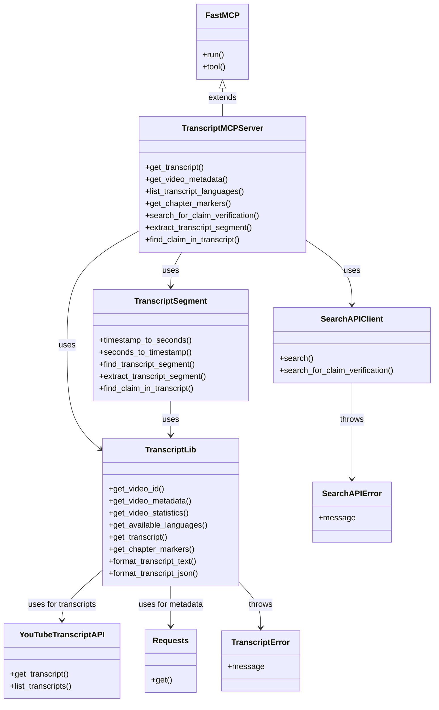
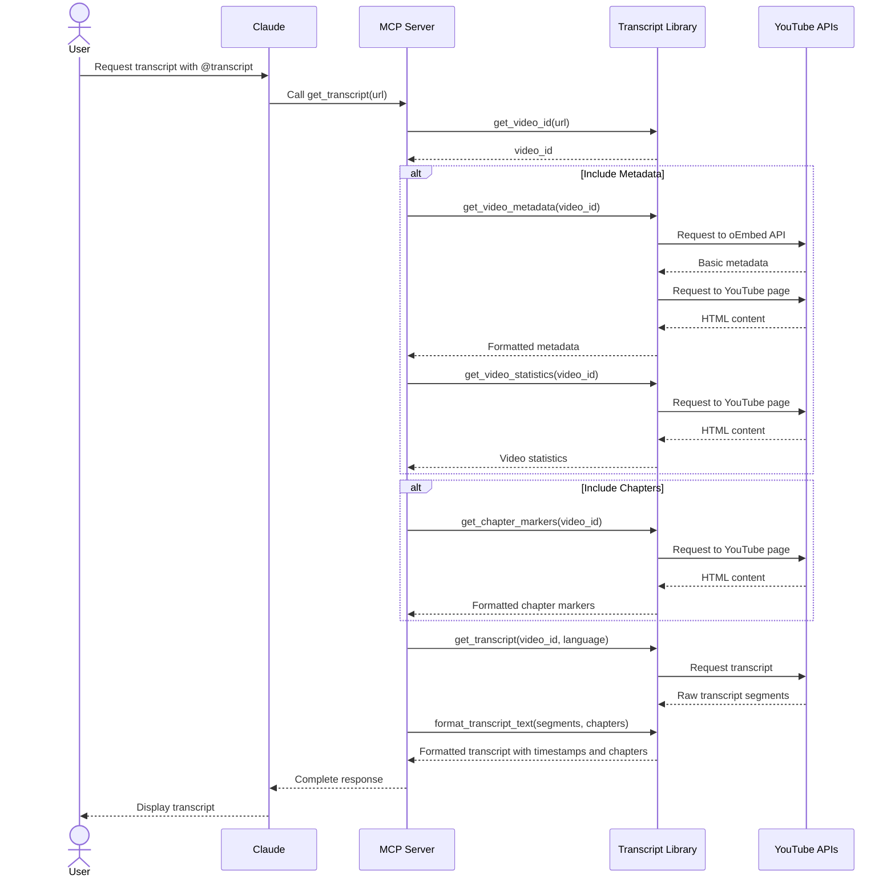

# Developer Guide: YouTube Transcript MCP Server

This guide provides a comprehensive overview of the YouTube Transcript MCP server architecture, implementation details, and development considerations for new contributors.

## Architectural Overview

The YouTube Transcript MCP server is built as a bridge between Claude and YouTube's transcript data. It leverages the MCP (Machine-Callable Program) protocol to enable Claude to fetch and process video transcripts in a structured way.

### System Architecture

```mermaid
graph TD
    subgraph "User Environment"
        User([User]) -->|Ask for transcript| Claude([Claude AI])
        Claude -->|Display results| User
    end
    
    subgraph "MCP Protocol"
        Claude -->|@transcript command| MCP[MCP Interface]
        MCP -->|Formatted response| Claude
    end
    
    subgraph "Transcript Server"
        MCP -->|Request| Server[Transcript MCP Server]
        Server -->|Process request| Library[Transcript Library]
        Library -->|Return data| Server
        Server -->|Formatted response| MCP
    end
    
    subgraph "External Services"
        Library -->|Fetch transcript| YT_API[YouTube Transcript API]
        Library -->|Fetch metadata| YT_Metadata[YouTube oEmbed API]
        Library -->|Fetch description| YT_Page[YouTube Page]
    end
    
    style User fill:#f9f,stroke:#333,stroke-width:2px
    style Claude fill:#bbf,stroke:#333,stroke-width:2px
    style Server fill:#bfb,stroke:#333,stroke-width:2px
    style Library fill:#bfb,stroke:#333,stroke-width:2px
    style YT_API fill:#fbb,stroke:#333,stroke-width:2px
    style YT_Metadata fill:#fbb,stroke:#333,stroke-width:2px
    style YT_Page fill:#fbb,stroke:#333,stroke-width:2px
```

### Component Diagram



### Data Flow Sequence



### Key Components

1. **MCP Server Layer (`transcript_mcp.py`)**
   - Implements the MCP protocol interface using FastMCP
   - Exposes tools for transcript, metadata, statistics, and chapter markers retrieval
   - Handles parameter parsing and response formatting
   - Provides fact-checking tools (added in latest version)

2. **Transcript Library (`transcript_lib.py`)**
   - Core business logic for transcript processing
   - Handles video ID extraction
   - Fetches transcript data, metadata, statistics, and chapter markers
   - Formats transcript text with timestamps and chapter markers

3. **Search API Client (`search_api.py`)**
   - Implements web search functionality for fact checking
   - Provides structured search results formatting
   - Handles API authentication and error management

4. **Transcript Segment Utilities (`transcript_segment.py`)**
   - Provides timestamp conversion and segment extraction
   - Implements claim finding with exact and fuzzy matching
   - Handles contextual segment analysis

5. **External Dependencies**
   - `youtube-transcript-api`: Primary engine for fetching transcript data
   - `requests`: Used for metadata retrieval through YouTube's oEmbed API
   - `aiohttp`: Used for asynchronous search API requests
   - `mcp`: Framework for building MCP-compatible servers

6. **Testing Infrastructure**
   - `test_transcript.py`: Tests the transcript functionality with logging
   - `test_chapter_markers.py`: Tests the chapter markers extraction functionality
   - `test_statistics.py`: Tests video statistics retrieval
   - `test_fact_checking.py`: Tests the fact-checking functionality

## Implementation Insights

### YouTube Transcript API Integration

The `youtube-transcript-api` package does the heavy lifting of transcript fetching, but has some limitations:

1. **Transcript Segmentation**
   - YouTube returns transcripts in very small segments (often 1-5 seconds)
   - Our implementation merges these into more readable ~10-second chunks
   - This merging logic is implemented in `format_transcript_text()` for better readability

2. **Language Handling**
   - Transcripts can exist in multiple languages
   - We offer a dedicated tool to list available languages
   - Automatic fallback to default language when not specified

### Metadata Extraction Approach

YouTube doesn't provide a simple public API for metadata, so we implemented a two-stage approach:

1. **oEmbed API** (primary source)
   - Used to fetch basic metadata (title, author)
   - Relatively stable and reliable
   - Limited in the information it provides

2. **HTML Parsing** (fallback for description)
   - We use regex to extract the description from page metadata
   - More fragile but necessary for getting the description
   - Implemented with error handling to avoid complete failures

This hybrid approach provides the best balance of reliability and comprehensive metadata.

### Timestamp Merging Logic

One of the more complex parts of the implementation is the algorithm for merging transcript segments:

```python
def format_transcript_text(transcript):
    merged_segments = []
    current_text = ""
    current_start = transcript[0]["start"]
    current_duration = 0
    
    for segment in transcript:
        # If adding this segment would exceed ~10 seconds, start a new merged segment
        if current_duration > 0 and current_duration + segment["duration"] > 10:
            # Format time as MM:SS
            minutes = int(current_start / 60)
            seconds = int(current_start % 60)
            timestamp = f"[{minutes:02d}:{seconds:02d}]"
            
            # Add the current merged segment to the result
            merged_segments.append(f"{timestamp} {current_text}")
            
            # Start a new segment
            current_text = segment["text"]
            current_start = segment["start"]
            current_duration = segment["duration"]
        else:
            # Add to the current segment
            if current_text:
                current_text += " " + segment["text"]
            else:
                current_text = segment["text"]
            current_duration += segment["duration"]
```

This algorithm:
1. Tracks the current accumulated duration
2. Merges segments until the ~10 second threshold is reached
3. Preserves the original start time for accurate timestamping

### Chapter Markers Extraction

One of the more complex features is the extraction of chapter markers from YouTube videos:

1. **Multiple Extraction Methods**
   - YouTube doesn't provide a dedicated API for chapters
   - We use several methods to maximize chances of success
   - Each method targets a different way YouTube might store chapter data

2. **Extraction Strategy**
   - First try to extract from the description (common user-created format)
   - Then look for structured data in various JSON objects in the page
   - Fall back to parsing the player response JSON
   - Finally check for structured LD+JSON metadata

3. **Integration with Transcript**
   - Chapters are displayed in two ways:
     - As a complete list at the top of the transcript output
     - Inserted at appropriate timestamps within the transcript text
   - This helps users both get an overview of the video structure and navigate long transcripts more easily

### Video Statistics Extraction

The video statistics feature was added to provide more comprehensive information about the videos:

1. **Extraction Methods**
   - Like chapter markers, we use HTML parsing to extract statistics
   - We target the initial data structure in the YouTube page
   - Look for key metrics like view count, likes, and upload date

2. **Error Handling**
   - Some statistics may be hidden or unavailable for certain videos
   - Our implementation handles missing statistics gracefully
   - Each metric is extracted independently, so a failure in one doesn't affect others

3. **Integration with Metadata**
   - Statistics can be included with standard metadata
   - This provides a more complete picture of the video context

## Development Guidelines

### Adding New Features

When adding new features to the YouTube Transcript MCP server, consider the following guidelines:

1. **Maintain Architecture**
   - Keep the separation between MCP server and core library
   - Add new functionality to the appropriate layer
   - Update documentation to reflect architectural changes

2. **Error Handling**
   - YouTube's structure can change or be inconsistent
   - Always include fallback mechanisms and error handling
   - Provide meaningful error messages for user feedback

3. **Testing**
   - Add appropriate test scripts for new functionality
   - Test with various YouTube videos to ensure robustness
   - Include logging for debugging and verification

### Feature Evaluation and Refactoring

As the project evolves, it's important to regularly evaluate features based on their effectiveness and value:

1. **Effectiveness Assessment**
   - Regularly test features with real-world YouTube videos
   - Gather feedback on the utility and reliability of each feature
   - Identify features that aren't working as intended or providing sufficient value

2. **Refactoring Considerations**
   - Simplify code where possible to improve maintainability
   - Remove features that don't provide adequate value relative to their complexity
   - Document architectural decisions and changes in the project_updates.md file

3. **Maintaining Core Value**
   - Focus development efforts on core functionality that provides the most user value
   - Prioritize reliability and robustness over adding new features
   - Consider the integration with Claude when evaluating feature importance

### Future Directions

The most promising areas for future development include:

1. **Reliability Improvements**
   - Add caching for frequently accessed videos
   - Improve error handling and recovery mechanisms
   - Add automated testing for core functionality

2. **Enhanced Transcript Processing**
   - Implement paragraph-based segmentation options
   - Add support for SRT and other transcript formats
   - Explore transcript summarization capabilities

3. **Search and Analysis**
   - Add search functionality within transcripts
   - Implement topic and keyword extraction
   - Enable cross-video analysis for related content

## Troubleshooting Common Issues

### YouTube API Changes

YouTube frequently changes its page structure, which can affect metadata extraction. If you encounter issues:

1. Check for changes in YouTube's page structure
2. Update regex patterns in the metadata extraction functions
3. Consider implementing additional fallback mechanisms

### Transcript Unavailability

Some videos may not have transcripts available. The server already handles this gracefully, but be aware that:

1. User-generated captions may be inconsistently formatted
2. Some channels disable transcripts for their videos
3. Automatic transcripts may have poor quality

### MCP Integration

If Claude is having trouble communicating with the MCP server:

1. Verify the configuration in claude_desktop_config.json
2. Check that paths to the MCP script are correct
3. Ensure the MCP server is properly responding to requests

## Documentation Maintenance

When updating the codebase, be sure to keep documentation in sync:

1. Update README.md with any user-facing changes
2. Update developer_guide.md with implementation details
3. Update progress_tracker.md to reflect completed features
4. Add significant architectural changes to project_updates.md

## Contributing

Contributions are welcome! Please follow these steps:

1. Check the progress_tracker.md for potential contribution areas
2. Fork the repository and create a feature branch
3. Implement your changes with appropriate tests and documentation
4. Submit a pull request with a clear description of your changes

Refer to the [Project Updates](project_updates.md) document for a history of major architectural decisions and changes.

### Running and Testing Scripts

1. **Running Scripts**
   - Always use `python3` to run scripts directly, rather than making them executable:
     ```
     python3 script_name.py [arguments]
     ```
   - This ensures consistent execution across different development environments

2. **Test First Development**
   - Create or update test scripts before modifying core functionality
   - Use the provided test scripts to verify changes:
     ```
     python3 test_transcript.py [video_id]
     python3 test_chapter_markers.py [video_id]
     python3 test_statistics.py [video_id]
     python3 test_top_chapter_markers.py [video_id]
     ```

3. **Logging Results**
   - All test scripts automatically save results to the `logs/` directory
   - Review these logs to verify changes and understand behavior

### Code Organization

// ... existing code ... 

## Fact-Checking Implementation

The fact-checking feature is implemented as a set of deterministic tools that help Claude verify information from YouTube videos. This section covers the design principles, component details, and development considerations for fact-checking.

### Design Principles

The fact-checking implementation follows these key principles:

1. **Deterministic Tools, AI Analysis**
   - The MCP server provides only deterministic tools for data retrieval
   - Claude performs all AI-based analysis, summarization, and reasoning
   - Clear separation of responsibilities leverages the strengths of both components

2. **Modular Architecture**
   - Each fact-checking component is implemented in a separate module with a clear interface
   - Components can be tested, maintained, and upgraded independently
   - New search providers or transcript analysis methods can be added easily

3. **Structured Data Flow**
   - Data passed between components uses consistent, well-defined structures
   - JSON format enables Claude to easily parse and reason about verification data

### Search API Integration

#### Architecture

The search API integration is implemented in `search_api.py` with these key components:

1. **Configuration Management**
   - API keys are loaded from environment variables (SEARCH_API_KEY)
   - Lazy initialization avoids errors if API key not set
   - Configurable endpoint to support different search providers

2. **Search Client Design**
   - `SearchAPIClient` class handles authentication, requests, and result formatting
   - Asynchronous implementation with `aiohttp` for efficient network requests
   - Comprehensive error handling with custom `SearchAPIError` exception

3. **Result Formatting**
   - Raw search results are transformed into a consistent, structured format
   - Knowledge graph data extraction when available
   - Temporal information (published dates) is preserved for context

#### Search Strategy

The fact-checking search uses a dual-query approach:

1. **Fact Check Query**: Appends "fact check" to the claim to find explicit fact-checking sources
2. **Information Query**: Searches directly for the claim to gather general information
3. **Combined Results**: Both result sets are returned to Claude for comprehensive analysis

```python
# Example of the dual-query strategy
query = f"fact check \"{claim}\""
results = await self.search(query)
direct_query = claim
direct_results = await self.search(direct_query)
```

#### Error Handling

Search API errors are handled at multiple levels:

1. **Network Errors**: Caught and wrapped in `SearchAPIError` with context
2. **API Errors**: HTTP status codes and response bodies are processed
3. **Missing API Key**: Checked before making requests to provide clear error message

### Transcript Segment Extraction

#### Timestamp Utilities

Timestamp conversion functions are implemented in `transcript_segment.py`:

1. **timestamp_to_seconds()**: Converts MM:SS or HH:MM:SS format to seconds
2. **seconds_to_timestamp()**: Converts seconds back to human-readable format
3. **Robust Validation**: Input validation with helpful error messages

#### Segment Extraction

The segment extraction functionality finds relevant parts of a transcript:

1. **Time-Based Extraction**: Extracts segments around a specific timestamp
2. **Context Window**: Configurable context_seconds parameter determines how much context to include
3. **Metadata Enrichment**: Adds video metadata and chapter information to segment output

#### Claim Finding

The claim finding functionality uses both exact and fuzzy matching:

1. **Exact Matching**: Finds claims that match exactly in the transcript
2. **Fuzzy Matching**: Uses word overlap scoring to find approximate matches
3. **Confidence Scoring**: Provides a match confidence score for fuzzy matches

```python
# Example of fuzzy matching
claim_words = set(normalized_claim.split())
text_words = set(text.split())
common_words = claim_words.intersection(text_words)
match_score = len(common_words) / len(claim_words)
```

### MCP Tool Implementation

The fact-checking MCP tools are implemented in `transcript_mcp.py`:

1. **search_for_claim_verification()**: Searches for information to verify claims
2. **extract_transcript_segment()**: Extracts transcript segments around timestamps
3. **find_claim_in_transcript()**: Locates specific claims in transcripts

Each tool follows these implementation patterns:

1. **Clear Documentation**: Comprehensive docstrings with parameter descriptions
2. **Error Handling**: Try/except blocks with specific error types
3. **Structured Output**: Consistent, well-formatted output for Claude to parse

### Testing Fact-Checking

The `test_fact_checking.py` script provides comprehensive testing:

1. **Component Testing**: Each fact-checking component can be tested individually
2. **Integration Testing**: Complete flow from claim to verification can be tested
3. **Logging**: Detailed logs of each step in the fact-checking process

To test the fact-checking feature:

```bash
python3 test_fact_checking.py <youtube_url_or_id> "claim to verify" [test_type]
```

Test types include:
- `all`: Run all fact-checking tests (default)
- `segment`: Test transcript segment extraction
- `search`: Test search for claim verification
- `find`: Test finding claim in transcript

### Development Guidelines

When working with the fact-checking components:

1. **API Keys**: Store API keys in environment variables, never commit them to the repo
2. **Error Handling**: Always use specific exception types and provide helpful error messages
3. **Result Formatting**: Maintain consistent JSON structures for Claude to parse
4. **Testing**: Write tests for new components and run existing tests after changes
5. **Dependency Management**: Add any new dependencies to requirements.txt
6. **Documentation**: Update function docstrings and add comments for complex logic

### Adding New Search Providers

To add a new search provider:

1. Modify the `SearchAPIClient` class to support the new provider
2. Create a new endpoint configuration option
3. Update the result formatting to handle the provider's response format
4. Add error handling specific to the provider
5. Update documentation to reflect the new provider option

// ... existing code ... 