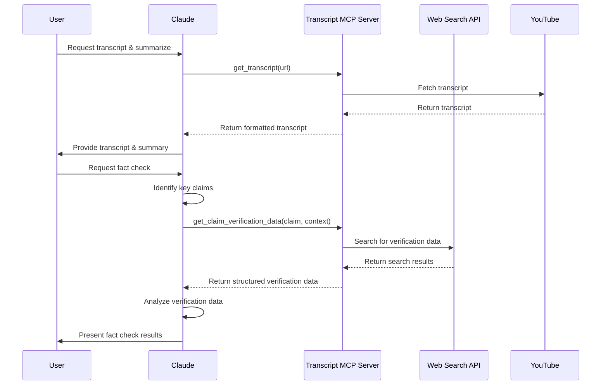

# Fact-Checking Feature Design

## Overview

The YouTube Transcript Fact-Checking feature enhances Claude's ability to verify information from YouTube videos. This design document outlines the implementation of a deterministic MCP component that will support Claude in fact-checking video content without directly performing AI inference within the MCP server.

## Design Principles

1. **Separation of Concerns**:
   - MCP Server: Provides deterministic tools for data retrieval and processing
   - Claude: Performs all LLM-based analysis, summarization, and fact-checking

2. **Data Flow**:
   - User requests transcript + summary from Claude
   - Claude fetches transcript via MCP
   - User requests fact-checking
   - Claude uses MCP tools to gather verification data
   - Claude performs the actual fact-checking analysis using gathered data

## Architecture



## New MCP Tools

### 1. `search_for_claim_verification()`

```python
@mcp.tool()
async def search_for_claim_verification(claim: str, context: Optional[str] = None) -> str:
    """Search for information to help verify a claim made in a video.
    
    Args:
        claim: The specific claim to verify (a statement that can be true or false)
        context: Optional context from the video to help with the search
        
    Returns:
        JSON-formatted search results that can help verify the claim
    """
```

This tool will:
- Take a specific claim and optional context as input
- Formulate search queries based on the claim
- Execute web searches to gather verification data
- Return structured results in a consistent format for Claude to analyze

### 2. `extract_transcript_segment()`

```python
@mcp.tool()
async def extract_transcript_segment(url: str, timestamp: str, context_seconds: int = 30) -> str:
    """Extract a specific segment of a transcript around a timestamp.
    
    Args:
        url: YouTube video URL or ID
        timestamp: Timestamp in format MM:SS or HH:MM:SS
        context_seconds: Number of seconds of context before and after (default: 30)
        
    Returns:
        The transcript segment with speakers and timestamps
    """
```

This tool will:
- Extract video ID from URL
- Convert timestamp to seconds
- Find the corresponding segment in the transcript
- Add surrounding context based on context_seconds
- Return the formatted transcript segment

## Implementation Strategy

### Phase 1: Web Search Integration

1. **Select Search API**:
   - Options: Serper, SerpAPI, Bing Search API, or Google Custom Search API
   - Implement a web search client class that handles authentication and requests

2. **Implement Search Formatting**:
   - Create utility functions to format search results consistently
   - Design a JSON schema for structured search results

3. **Add Configuration**:
   - Add API keys and configuration options to a secure configuration file
   - Implement configuration loading in the MCP server

### Phase 2: Transcript Segment Extraction

1. **Enhance Transcript Library**:
   - Add functionality to convert between timestamp formats
   - Implement segment extraction with context
   - Add support for finding specific claims in transcripts

2. **Testing**:
   - Create test cases with known claims and videos
   - Verify correct segment extraction

### Phase 3: MCP Integration

1. **Add New MCP Tools**:
   - Implement the two new MCP tools described above
   - Add proper error handling and documentation

2. **User Experience**:
   - Document usage patterns for Claude
   - Create example fact-checking prompts

## User Experience

### Example Usage

```
User: @transcript get_transcript https://www.youtube.com/watch?v=ELj2LLNP8Ak and summarize

Claude: [fetches transcript and provides summary]

User: Please fact check the claim that "AI will replace all programmers by 2025" made at 12:34 in the video

Claude: [identifies claim and context]
[uses search_for_claim_verification to gather data]
[analyzes search results]
[provides fact check analysis]
```

## Considerations

### Privacy and Data Handling

- All search queries will be derived from user input and video content
- No user data will be stored beyond the current session
- Search results will be returned directly to Claude without modification

### Rate Limiting and Quotas

- Search APIs typically have rate limits and quotas
- Implement retry logic with exponential backoff
- Add configurable limits to prevent quota exhaustion

### Response Formatting

- Ensure search results are well-structured for Claude to analyze
- Include source URLs, snippets, and publication dates
- Provide confidence metrics where available

## Future Enhancements

1. **Citation Support**:
   - Enhanced citation formatting for fact-check sources
   - PDF/document retrieval for academic sources

2. **Specialized Sources**:
   - Integration with fact-checking websites
   - Academic paper databases
   - Trusted news sources

3. **Temporal Context**:
   - Consider publication dates of sources vs. video date
   - Historical context for evolving topics

## Implementation Timeline

1. **Week 1**: Setup and search API integration
2. **Week 2**: Transcript segment extraction implementation
3. **Week 3**: MCP tool implementation and testing
4. **Week 4**: Documentation and refinement 