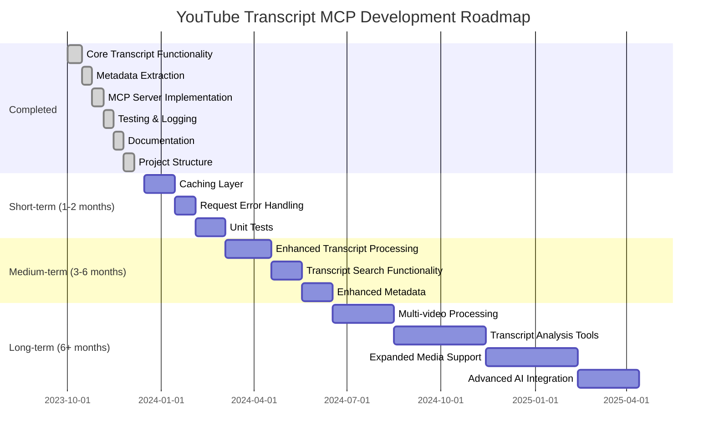

# YouTube Transcript MCP Project Progress Tracker

## Completed Features

- [x] **Core Transcript Functionality**
  - [x] Extract video ID from YouTube URLs
  - [x] Fetch raw transcript data using youtube-transcript-api
  - [x] Support for language selection
  - [x] Error handling for videos without transcripts
  - [x] Intelligent ~10 second transcript segment merging

- [x] **Metadata Extraction**
  - [x] Video title retrieval
  - [x] Author/channel information
  - [x] Video description parsing
  - [x] Thumbnail URL retrieval
  - [x] Hybrid approach combining oEmbed API and HTML parsing
  - [x] Video statistics extraction (views, likes, upload date)

- [x] **Chapter Markers**
  - [x] Extract chapter markers from YouTube videos
  - [x] Multiple extraction methods for maximum reliability
  - [x] Integrated chapter display in transcripts
  - [x] Standalone chapter marker retrieval tool
  - [x] Chapter-aware transcript formatting

- [x] **MCP Server Implementation**
  - [x] `get_transcript` tool with metadata integration
  - [x] `get_video_metadata` tool for metadata-only requests
  - [x] `list_transcript_languages` tool for language discovery
  - [x] `get_chapter_markers` tool for chapter retrieval
  - [x] Parameter handling for customization

- [x] **Testing & Logging**
  - [x] Command-line test scripts for transcript and metadata
  - [x] Test script for chapter markers extraction
  - [x] Test script for video statistics
  - [x] Detailed logging with timestamps
  - [x] JSON and text output formats
  - [x] Organized log file storage

- [x] **Documentation**
  - [x] Installation and setup instructions
  - [x] Usage examples for each tool
  - [x] Architectural diagrams (system overview, component structure, sequence)
  - [x] Developer guide with implementation insights
  - [x] Project structure documentation

- [x] **Project Structure**
  - [x] Flattened directory organization
  - [x] Separated log storage
  - [x] Clean module imports
  - [x] Proper error classes

## Current Project Status

The YouTube Transcript MCP Server is fully functional with the following capabilities:

- Fetch transcripts from any YouTube video that has captions
- Display transcripts with ~10 second merged segments for improved readability
- Retrieve and include comprehensive video metadata (title, author, description)
- Extract video statistics (view count, likes, upload date)
- Identify and display chapter markers within videos
- Support multiple languages when available
- MCP integration with Claude Desktop

All core functionality is implemented and working, with comprehensive documentation in place.

## Development Roadmap

## Next Steps

### Short-term Improvements

- [ ] **Performance Optimizations**
  - [ ] Add caching layer for frequently accessed videos
  - [ ] Implement request timeout handling
  - [ ] Add retry logic for transient network errors

- [ ] **Enhanced Transcript Processing**
  - [ ] Add option for paragraph-based segmentation
  - [ ] Implement speaker detection/attribution when available
  - [ ] Support for SRT export format

- [ ] **Testing & Validation**
  - [ ] Add unit tests with pytest
  - [ ] Create a test suite with sample videos
  - [ ] Add CI/CD pipeline for automated testing

### Medium-term Features

- [ ] **Advanced Search**
  - [ ] Implement within-transcript search functionality
  - [ ] Add timestamp jumping for search results
  - [ ] Support for regex-based searches

- [ ] **Enhanced Metadata**
  - [ ] Video statistics (views, likes, publish date)
  - [ ] Channel subscriber information
  - [ ] Related videos suggestions

- [ ] **Transcript Analysis**
  - [ ] Automatic transcript summarization
  - [ ] Keyword extraction
  - [ ] Topic modeling

### Long-term Vision

- [ ] **Multi-video Processing**
  - [ ] Support for processing playlists
  - [ ] Batch transcript fetching
  - [ ] Comparative analysis across multiple videos

- [ ] **Expanded Media Support**
  - [ ] Support for other video platforms (Vimeo, etc.)
  - [ ] Integration with additional media sources
  - [ ] Handling of audio-only content

- [ ] **Advanced AI Integration**
  - [ ] Custom embeddings of transcript content
  - [ ] Integration with other LLM-powered analysis
  - [ ] Domain-specific knowledge extraction

## Technical Debt / Known Issues

- YouTube's page structure may change, potentially breaking the description extraction
- No automated retry mechanism for failed requests
- No caching system implemented yet
- Limited error handling for edge cases
- No test coverage measurement

## Contributing

If you'd like to contribute to this project, please consider addressing one of the items in the Next Steps section above. Please refer to the [Developer Guide](developer_guide.md) for details on the architecture and implementation approach. 